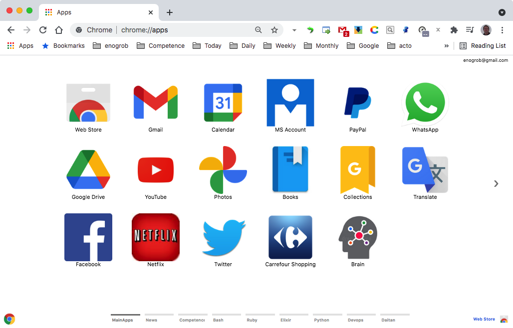

# Chrome Apps for MainApps


## Installation

### 1. Clone this repository and see its contents.
Open a terminal give the following command:

```bash
$ git clone https://github.com/enogrob/chromeapps-webtools.git
```

As we can see a subdirectory is created for each MainApps app.

```bash
$ ls -la
total 984
drwxr-xr-x@   8 enogrob  staff    272 Oct  9 17:00 .
drwxr-xr-x@ 304 enogrob  staff  10336 Oct  9 17:00 ..
-rw-r--r--@   1 enogrob  staff   6148 Oct  5 23:25 .DS_Store
-rw-r--r--@   1 enogrob  staff      6 Aug  1  2016 .gitignore
-rw-r--r--@   1 enogrob  staff      0 Nov 17  2016 Icon?
-rw-r--r--@   1 enogrob  staff    967 Oct  9 17:06 README.md
drwxr-xr-x   14 enogrob  staff    476 Oct  9 17:02 apps
drwxr-xr-x    4 enogrob  staff    136 Oct  9 12:25 images

$ tree -L 1 apps/
apps
├── MainApps-Caixa
├── MainApps-Carrefour
├── MainApps-CarrefourShopping
├── MainApps-DropBox
├── MainApps-Facebook
├── MainApps-Gmail
├── MainApps-Google_Drive
├── MainApps-Itau
├── MainApps-MSAccount
├── MainApps-Netflix
├── MainApps-PlayStationStore
└── MainApps-PrimeVideo


21 directories, 0 files
```

### 2. Open Chrome with the following url:
In order to load the `Chrome Apps` for MainApps, check `Developer Mode` and press `Load unpacked extension...` to load each App selecting its corresponding directory inside `apps` e.g. `MainApps-Gmail`, and then repeat that for the wanted apps. Or just drag and drop the app folder on the [Extensions page](chrome://extensions).

[chrome://extensions](chrome://extensions)

### 3. After load the Chrome Apps wanted for MainApps, Chrome will look like the screenshot below:

